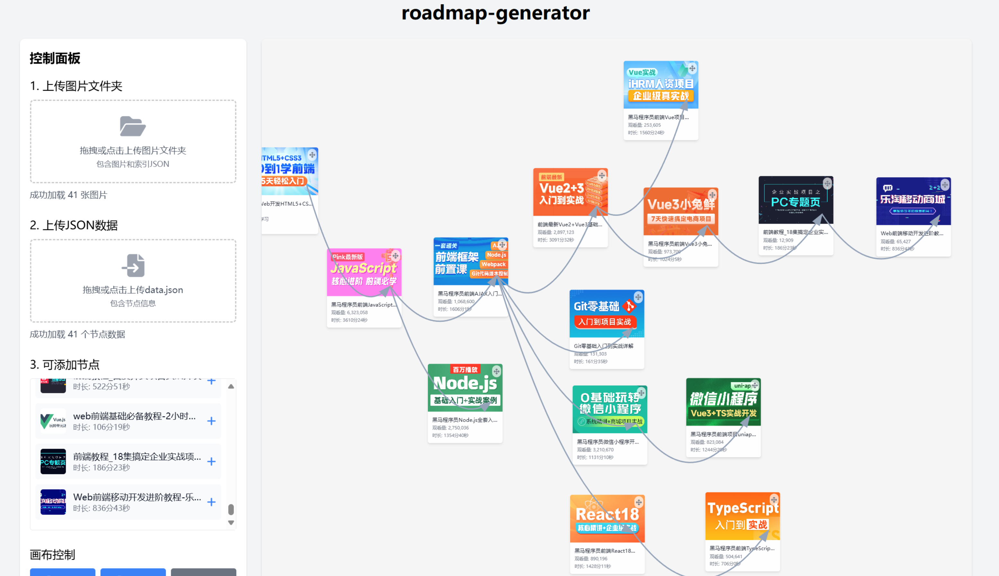

# roadmap-generator

`data/data.json`  原始json数据（b站up主专栏页的封面接口）

1、解决图片外链问题

使用 `utils/pic_downloader.py`将图片存到 `pics`文件夹中并生成 `index.json`索引文件

2、road-map编辑数据

- 上传pics/
- 上传data.json，和pics/index.json 建立图片对应关系
- （可选）导入数据
- 编辑数据，点击编辑list
- 导出node和edge数据

